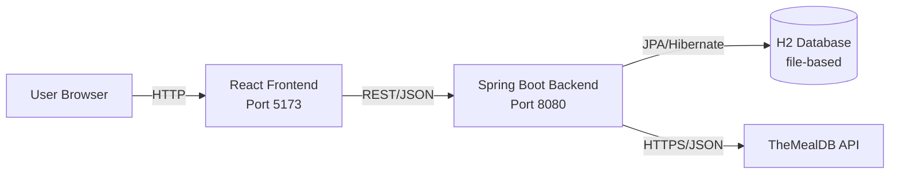
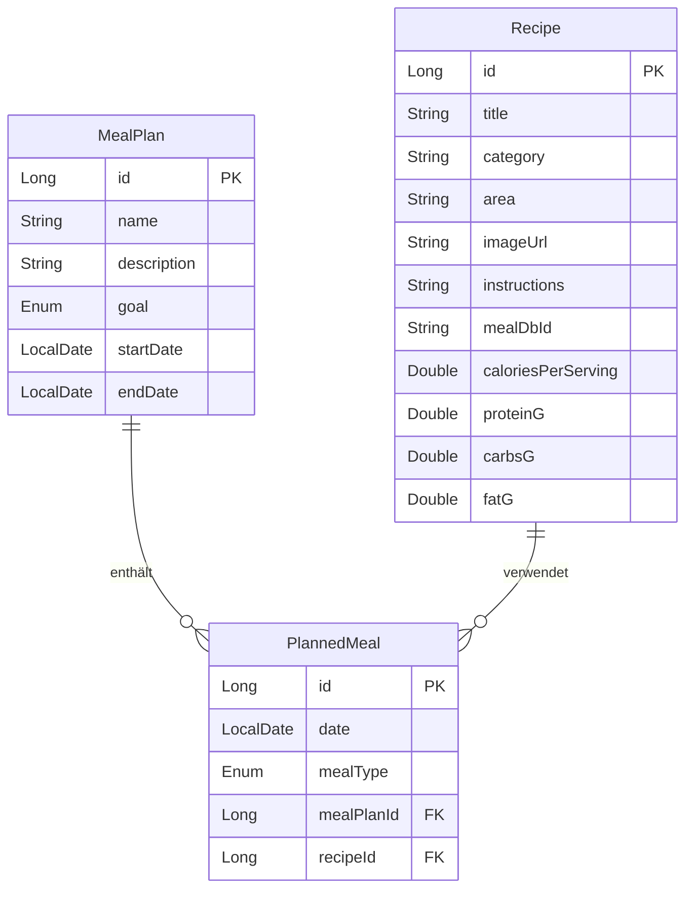

# Mealplanner

Eine Webanwendung zur Planung von Mahlzeiten und zur Verwaltung von Rezepten, mit Integration der TheMealDB-API für Rezept-Inspirationen.

Entwickelt als Prüfungsleistung im Modul T4INF4212 (Web-Engineering II) an der DHBW Ravensburg, SS 2026.

## Features

- **Rezeptverwaltung**: Rezepte mit Titel, Kategorie, Herkunft, Zubereitungsanleitung und optionalen Nährwerten (Kalorien, Protein, Carbs, Fett) anlegen, ansehen, bearbeiten, löschen
- **Mahlzeitenpläne**: Ernährungspläne mit Ziel (Cut/Bulk/Maintain), Zeitraum und Beschreibung
- **Geplante Mahlzeiten**: Konkrete Rezepte an konkreten Tagen in einen Plan einfügen, gruppiert nach Datum, mit Frühstück/Mittag/Abend/Snack
- **TheMealDB-Integration**: Externe Rezeptdatenbank durchsuchen, Zufallsrezepte ziehen und direkt in die eigene Sammlung importieren (idempotent)
- **Eingabevalidierung** mit Bean Validation, sinnvolle HTTP-Statuscodes auf allen Endpoints
- **Drei Testarten**: Unit-Tests (Mockito), Repository-Integration (@DataJpaTest), Controller-Integration (@WebMvcTest mit MockMvc)

## Architektur (AI-Generated)



Backend folgt einer klassischen Schichtenarchitektur:

- **Controller**: REST-Endpoints, DTO ↔ Entity Mapping
- **Service**: Geschäftslogik (Validierung, idempotenter Import, Cross-Repository-Lookups)
- **Repository**: Datenbankzugriff via Spring Data JPA
- **Model/Entity**: JPA-Entities mit @ManyToOne-Beziehungen

Die externe TheMealDB-API ist im Package `external` gekapselt – inkl. eigener DTOs, damit das Domänenmodell unabhängig von der Fremd-API bleibt.

## Tech Stack

| Schicht | Technologie |
|---------|-------------|
| Backend | Java 21, Spring Boot 3.4.5, Spring Data JPA, Spring Web, Bean Validation |
| Frontend | React 18, Vite, React Router 6 |
| Datenbank | H2 (file-based) |
| Build | Maven (Backend), npm/Vite (Frontend) |
| Tests | JUnit 5, Mockito, AssertJ, Spring Boot Test, MockMvc |
| Externe API | TheMealDB |

## Voraussetzungen

- Java 21 (z.B. Eclipse Temurin)
- Node.js 20 oder neuer
- npm (kommt mit Node)
- Git

## Lokales Starten

### 1. Repository klonen

```bash
git clone https://github.com/ayMischa/mealplanner.git
cd mealplanner
```

### 2. Backend starten

```bash
./mvnw spring-boot:run
```

(Windows: `mvnw.cmd spring-boot:run`)

Das Backend läuft auf http://localhost:8080.

Beim ersten Start erzeugt H2 automatisch die Datenbankdatei unter `data/mealplanner.mv.db`. Folgende Endpoints stehen direkt zum Testen bereit:

- http://localhost:8080/api/recipes
- http://localhost:8080/api/meal-plans
- http://localhost:8080/api/mealdb/random
- http://localhost:8080/h2-console (Datenbank-Konsole, JDBC URL: `jdbc:h2:file:./data/mealplanner`, User: `sa`, Passwort leer)

### 3. Frontend starten

In einem zweiten Terminal:

```bash
cd frontend
npm install
npm run dev
```

Das Frontend läuft auf http://localhost:5173.

## API-Übersicht

### Recipes – `/api/recipes`

| Methode | Pfad | Zweck |
|---------|------|-------|
| GET | `/api/recipes` | Alle Rezepte |
| GET | `/api/recipes/{id}` | Einzelnes Rezept |
| POST | `/api/recipes` | Neues Rezept anlegen |
| PUT | `/api/recipes/{id}` | Rezept aktualisieren |
| DELETE | `/api/recipes/{id}` | Rezept löschen |
| POST | `/api/recipes/from-mealdb/{mealDbId}` | Aus TheMealDB importieren |

### Meal Plans – `/api/meal-plans`

| Methode | Pfad | Zweck |
|---------|------|-------|
| GET | `/api/meal-plans?goal=CUT` | Alle Pläne (optional gefiltert) |
| GET | `/api/meal-plans/{id}` | Einzelner Plan |
| POST | `/api/meal-plans` | Neuen Plan anlegen |
| PUT | `/api/meal-plans/{id}` | Plan aktualisieren |
| DELETE | `/api/meal-plans/{id}` | Plan löschen |

### Planned Meals – `/api/planned-meals`

| Methode | Pfad | Zweck |
|---------|------|-------|
| GET | `/api/planned-meals?mealPlanId=X&date=YYYY-MM-DD` | Mahlzeiten (optional gefiltert) |
| GET | `/api/planned-meals/{id}` | Einzelne Mahlzeit |
| POST | `/api/planned-meals` | Mahlzeit hinzufügen |
| PUT | `/api/planned-meals/{id}` | Mahlzeit aktualisieren |
| DELETE | `/api/planned-meals/{id}` | Mahlzeit löschen |

### MealDB Browse – `/api/mealdb`

| Methode | Pfad | Zweck |
|---------|------|-------|
| GET | `/api/mealdb?q=chicken` | Suche bei TheMealDB |
| GET | `/api/mealdb/random` | Zufälliges Rezept |
| GET | `/api/mealdb/{id}` | Einzelnes externes Rezept |

Beispielrequests inklusive verketteter Tests in [`src/test/resources/api-tests.http`](src/test/resources/api-tests.http) – ausführbar direkt in IntelliJ.

## Tests ausführen

```bash
./mvnw test
```

Über 19 Tests in drei Kategorien:

- **Unit-Tests** (`mapper/`, `service/`): testen einzelne Klassen isoliert mit Mockito
- **Repository-Integration-Tests** (`repository/`): testen JPA-Repositories gegen In-Memory-H2 via `@DataJpaTest`
- **Controller-Integration-Tests** (`controller/`): testen REST-Endpoints mit MockMvc via `@WebMvcTest`, Service ist gemockt

## Drittanbieter-API: TheMealDB

[TheMealDB](https://www.themealdb.com) liefert kostenlose Rezeptdaten ohne API-Key (Test-Endpoint mit Key `1`). Das Backend kapselt den Zugriff im `MealDbApiClient` (Package `external`), wandelt die Daten ins interne Recipe-Format und cachet sie in der lokalen Datenbank. Wiederholte Imports derselben MealDB-ID sind idempotent – existiert das Rezept bereits, wird kein neuer externer Call gemacht.

Base-URL konfigurierbar in `application.properties` über `mealdb.base-url`.

## Projektstruktur

```
mealplanner/
├── src/main/java/de/dhbw/webeng/mealplanner/
│   ├── config/         # Spring Config (CORS, RestClient)
│   ├── controller/     # REST-Endpoints
│   ├── dto/            # Request/Response DTOs (Records)
│   ├── external/       # TheMealDB-Client + externe DTOs
│   ├── mapper/         # Entity ↔ DTO Mapping
│   ├── model/          # JPA-Entities und Enums
│   ├── repository/     # Spring Data Repositories
│   └── service/        # Geschäftslogik
├── src/main/resources/
│   └── application.properties
├── src/test/           # Unit- und Integrations-Tests
├── frontend/           # React-App (Vite)
│   └── src/
│       └── components/ # React-Komponenten
├── data/               # H2-Datenbankdatei (gitignored)
└── pom.xml
```

## Datenmodell (AI-Generated)


