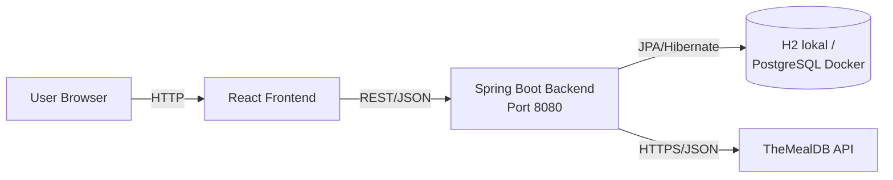
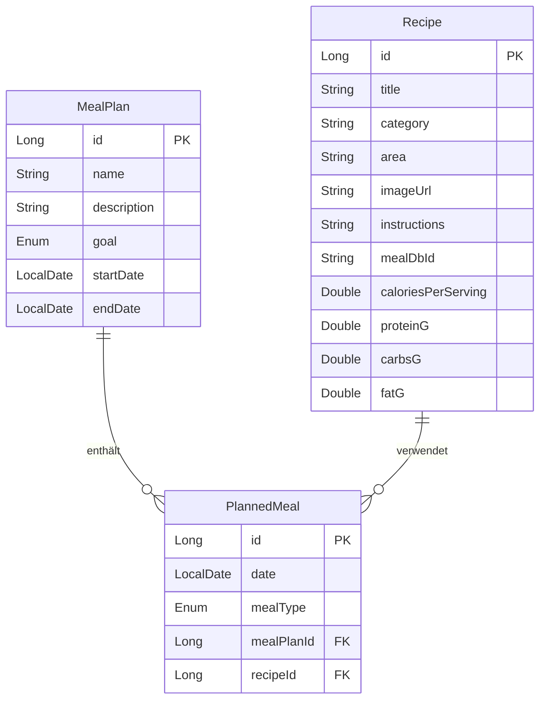

# Mealplanner

Eine Webanwendung zur Planung von Mahlzeiten und zur Verwaltung von Rezepten, mit Integration der TheMealDB-API für Rezept-Inspirationen.

**Modul:** T4INF4212 Web-Engineering II

**Semester:** SoSe 2026, DHBW Informatik Friedrichshafen, 2. Semester

**Arbeitsform:** Einzelarbeit

**Bearbeitung:** Semesterbegleitend

## Features

- **Rezeptverwaltung**: Rezepte mit Titel, Kategorie, Herkunft, Zubereitungsanleitung und optionalen Nährwerten (Kalorien, Protein, Carbs, Fett) anlegen, ansehen, bearbeiten, löschen
- **Mahlzeitenpläne**: Ernährungspläne mit Ziel (Cut/Bulk/Maintain), Zeitraum und Beschreibung
- **Geplante Mahlzeiten**: Konkrete Rezepte an konkreten Tagen in einen Plan einfügen, gruppiert nach Datum, mit Frühstück/Mittag/Abend/Snack
- **TheMealDB-Integration**: Externe Rezeptdatenbank durchsuchen, Zufallsrezepte ziehen und direkt in die eigene Sammlung importieren (idempotent)
- **Eingabevalidierung** mit Bean Validation und **globales Fehler-Handling** im RFC-7807-Format (ProblemDetail) über `@RestControllerAdvice` – konsistente, maschinenlesbare Fehlerantworten mit passenden HTTP-Statuscodes
- **Drei Testarten**: Unit-Tests (Mockito), Repository-Integration (`@DataJpaTest`), Controller-Integration (`@WebMvcTest` mit MockMvc)
- **DevOps**: Multi-Stage-Docker-Builds, Docker Compose (Backend + Frontend + PostgreSQL), GitHub-Actions-CI-Pipeline und OpenAPI/Swagger-Dokumentation

## Architektur (KI-Generiert)



Backend folgt einer klassischen Schichtenarchitektur:

- **Controller**: REST-Endpoints, DTO <--> Entity Mapping
- **Service**: Geschäftslogik (Validierung, idempotenter Import, Cross-Repository-Lookups)
- **Repository**: Datenbankzugriff via Spring Data JPA
- **Model/Entity**: JPA-Entities mit @ManyToOne-Beziehungen
- **Exception-Handling**: zentraler `@RestControllerAdvice`, der Fehler ins RFC-7807-ProblemDetail-Format übersetzt

Die externe TheMealDB-API ist im Package `external` gekapselt – inkl. eigener DTOs, damit das Domänenmodell unabhängig von der Fremd-API bleibt. Dank der JPA-Abstraktion läuft dieselbe Codebasis ohne Änderung gegen H2 (lokal) und PostgreSQL (Docker).

## Tech Stack

| Schicht | Technologie                                                              |
|---------|--------------------------------------------------------------------------|
| Backend | Java 21, Spring Boot 3.4.5, Spring Data JPA, Spring Web, Bean Validation |
| Frontend | React 19, Vite, React Router 7                                           |
| Datenbank | H2 (lokal), PostgreSQL (Docker) – via Spring Data JPA                    |
| API-Doku | OpenAPI / Swagger (springdoc)                                            |
| Container | Docker, Docker Compose, Nginx (Frontend-Auslieferung)                    |
| CI/CD | GitHub Actions                                                           |
| Build | Maven (Backend), npm/Vite (Frontend)                                     |
| Tests | JUnit 5, Mockito, AssertJ, Spring Boot Test, MockMvc                     |
| Externe API | TheMealDB                                                                |

## Voraussetzungen

- Java 21 (z.B. Eclipse Temurin)
- Node.js 20 oder neuer
- npm (kommt mit Node)
- Git
- Docker & Docker Compose (optional, nur für den Docker-Start)

## Konfiguration

Sensible Konfiguration läuft über Environment-Variablen, nicht über Code-Konstanten. Eine Vorlage findet sich in `.env.example`.

Für die Entwicklung ist **kein eigener API-Key nötig**: TheMealDB stellt den Test-Endpoint mit Key `1` frei bereit (Default in `application.properties`). Für einen eigenen MealDB-Key:

```bash
# Linux/macOS
export MEALDB_API_KEY=dein-key

# Windows PowerShell
$env:MEALDB_API_KEY="dein-key"
```

Eine `.env`-Datei mit echten Werten ist in `.gitignore` ausgenommen und wird nicht eingecheckt.

## Lokales Starten

Standardmäßig (ohne Docker) läuft die Anwendung gegen eine H2-Datenbank.

### 1. Repository klonen

```bash
git clone https://github.com/ayMischa/mealplanner.git
cd mealplanner
```

### 2. Backend starten

```bash
./mvnw spring-boot:run
```

(Windows: `mvnw.cmd spring-boot:run`)

Das Backend läuft auf http://localhost:8080.

Beim ersten Start erzeugt H2 automatisch die Datenbankdatei unter `data/mealplanner.mv.db`. Folgende Endpoints stehen direkt zum Testen bereit:

- http://localhost:8080/api/recipes
- http://localhost:8080/api/meal-plans
- http://localhost:8080/api/mealdb/random
- http://localhost:8080/swagger-ui.html (interaktive API-Dokumentation)
- http://localhost:8080/h2-console (Datenbank-Konsole, JDBC URL: `jdbc:h2:file:./data/mealplanner`, User: `sa`, Passwort leer)

### 3. Frontend starten

In einem zweiten Terminal:

```bash
cd frontend
npm install
npm run dev
```

Das Frontend läuft auf http://localhost:5173. Der Vite-Dev-Proxy leitet `/api`-Anfragen an das Backend auf Port 8080 weiter.

## Starten mit Docker

Die gesamte Anwendung (Backend + Frontend + PostgreSQL) lässt sich mit einem Befehl starten -> Docker und Docker Compose vorausgesetzt:

```bash
docker compose up --build
```

Anschließend erreichbar:
- Frontend: http://localhost:3000
- Backend API / Swagger: http://localhost:8080/swagger-ui.html

Stoppen mit `Strg+C`, vollständiges Aufräumen mit `docker compose down`.

Das Docker-Setup nutzt **PostgreSQL** als Datenbank (eigener Container, aktiviert über das Spring-Profil `postgres`). Die Daten bleiben dank eines Docker-Volumes über Neustarts hinweg erhalten. Ohne Docker (lokaler Start) wird H2 verwendet – die Anwendung läuft dank der JPA-Abstraktion unverändert mit beiden Datenbanken.

## API-Übersicht

### Interaktive API-Dokumentation (Swagger)

Bei laufendem Backend ist die vollständige, interaktive API-Dokumentation verfügbar unter:

- Swagger UI: http://localhost:8080/swagger-ui.html
- OpenAPI-Spezifikation (JSON): http://localhost:8080/v3/api-docs

Die Dokumentation wird automatisch aus den Controllern, DTOs und Validierungsregeln generiert.

### Recipes – `/api/recipes`

| Methode | Pfad | Zweck |
|---------|------|-------|
| GET | `/api/recipes` | Alle Rezepte |
| GET | `/api/recipes/{id}` | Einzelnes Rezept |
| POST | `/api/recipes` | Neues Rezept anlegen |
| PUT | `/api/recipes/{id}` | Rezept aktualisieren |
| DELETE | `/api/recipes/{id}` | Rezept löschen |
| POST | `/api/recipes/from-mealdb/{mealDbId}` | Aus TheMealDB importieren |

### Meal Plans – `/api/meal-plans`

| Methode | Pfad | Zweck |
|---------|------|-------|
| GET | `/api/meal-plans?goal=CUT` | Alle Pläne (optional gefiltert) |
| GET | `/api/meal-plans/{id}` | Einzelner Plan |
| POST | `/api/meal-plans` | Neuen Plan anlegen |
| PUT | `/api/meal-plans/{id}` | Plan aktualisieren |
| DELETE | `/api/meal-plans/{id}` | Plan löschen |

### Planned Meals – `/api/planned-meals`

| Methode | Pfad | Zweck |
|---------|------|-------|
| GET | `/api/planned-meals?mealPlanId=X&date=YYYY-MM-DD` | Mahlzeiten (optional gefiltert) |
| GET | `/api/planned-meals/{id}` | Einzelne Mahlzeit |
| POST | `/api/planned-meals` | Mahlzeit hinzufügen |
| PUT | `/api/planned-meals/{id}` | Mahlzeit aktualisieren |
| DELETE | `/api/planned-meals/{id}` | Mahlzeit löschen |

### MealDB Browse – `/api/mealdb`

| Methode | Pfad | Zweck |
|---------|------|-------|
| GET | `/api/mealdb?q=chicken` | Suche bei TheMealDB |
| GET | `/api/mealdb/random` | Zufälliges Rezept |
| GET | `/api/mealdb/{id}` | Einzelnes externes Rezept |

Beispielrequests inklusive verketteter Tests in [`src/test/resources/api-tests.http`](src/test/resources/api-tests.http) – ausführbar direkt in IntelliJ.

## Tests ausführen

```bash
./mvnw test
```

20 Tests in drei Kategorien:

- **Unit-Tests** (`mapper/`, `service/`): testen einzelne Klassen isoliert mit Mockito
- **Repository-Integration-Tests** (`repository/`): testen JPA-Repositories gegen In-Memory-H2 via `@DataJpaTest`
- **Controller-Integration-Tests** (`controller/`): testen REST-Endpoints mit MockMvc via `@WebMvcTest`, Service ist gemockt

## CI/CD

Bei jedem Push und Pull Request auf `main` läuft eine GitHub-Actions-Pipeline (`.github/workflows/ci.yml`), die

- das Backend baut und testet (`./mvnw clean verify`)
- das Frontend baut (`npm run build`)

So ist sichergestellt, dass der `main`-Branch jederzeit baubar und grün ist.

## Drittanbieter-API: TheMealDB
KI-Generierte beschreibung:
[TheMealDB](https://www.themealdb.com) liefert kostenlose Rezeptdaten ohne API-Key (Test-Endpoint mit Key `1`). Das Backend kapselt den Zugriff im `MealDbApiClient` (Package `external`), wandelt die Daten ins interne Recipe-Format und cachet sie in der lokalen Datenbank. Wiederholte Imports derselben MealDB-ID sind idempotent – existiert das Rezept bereits, wird kein neuer externer Call gemacht.

Der `RestClient` ist mit Connect- und Read-Timeouts konfiguriert, damit ein hängender externer Aufruf keinen Server-Thread unbegrenzt blockiert. API-Key und Base-URL sind über die Environment-Variable `MEALDB_API_KEY` bzw. `application.properties` konfigurierbar (siehe Abschnitt [Konfiguration](#konfiguration)).

## Projektstruktur (KI-Generiert)

```
mealplanner/
├── .github/workflows/
│   └── ci.yml                              # GitHub-Actions-CI-Pipeline
├── src/main/java/de/dhbw/webeng/mealplanner/
│   ├── config/         # Spring Config (CORS, RestClient mit Timeouts)
│   ├── controller/     # REST-Endpoints
│   ├── dto/            # Request/Response DTOs (Records)
│   ├── exception/      # Custom Exceptions + globaler Handler (ProblemDetail)
│   ├── external/       # TheMealDB-Client + externe DTOs
│   ├── mapper/         # Entity ↔ DTO Mapping
│   ├── model/          # JPA-Entities und Enums
│   ├── repository/     # Spring Data Repositories
│   └── service/        # Geschäftslogik
├── src/main/resources/
│   ├── application.properties              # Standard-Profil (H2)
│   └── application-postgres.properties     # Profil "postgres" (Docker)
├── src/test/           # Unit- und Integrations-Tests
├── frontend/           # React-App (Vite)
│   ├── src/
│   │   ├── api.js          # zentrale API-Schicht
│   │   └── components/     # React-Komponenten
│   ├── Dockerfile          # Frontend-Image (Build + Nginx)
│   └── nginx.conf          # Nginx-Config (statische Auslieferung + /api-Proxy)
├── data/               # H2-Datenbankdatei (gitignored)
├── Dockerfile          # Backend-Image (Multi-Stage)
├── docker-compose.yml  # Orchestrierung: Backend + Frontend + PostgreSQL
├── .env.example        # Vorlage für Environment-Variablen
└── pom.xml
```

## Datenmodell (KI-Generiert)


